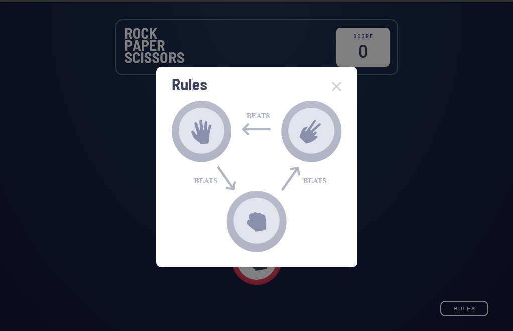
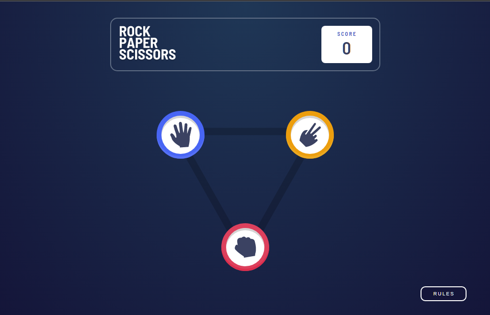
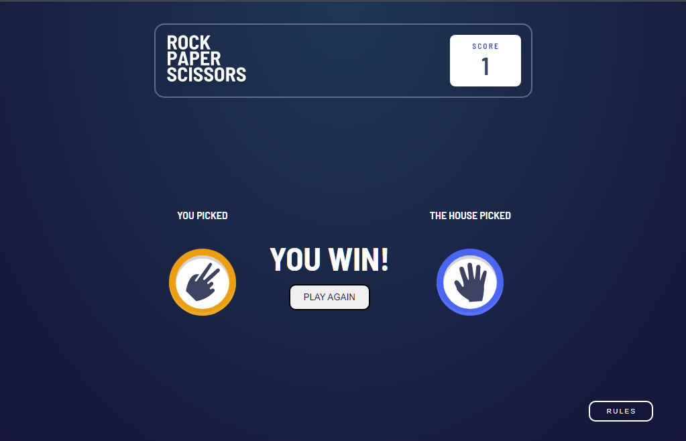

# Rock-Paper-Scissors-game

- [Features](#features)
- [Live Demo](#live-demo)
- [Screenshots](#screenshots)
- [How to Use](#how-to-use)
- [Contributing](#contributing)
- [License](#license)

The rock-paper-scissors game is fully functional, designed with Sass, and utilizes local storage to track the score

## <a id="features">Features</a>

- Responsiveness that perfectly adjusts to both desktop and mobile screens.
- Local storage to store the player's score.
- Fully styled using Sass.
- Rules window displayed on page load until the player achieves their first victory.
- Button to display the rules at any time during the game.
- Play against the computer, which makes random moves.

## <a id="live-demo">Live demo</a>

Try the live version of the page clone [here](https://loquacious-tulumba-b91d83.netlify.app/)

## <a id="screenshots">Sceenshots</a>

Here are some screenshots of the page clone in action: 

## <a id="how-to-use">How to use it</a>

1. Clone or download the repository
2. Open the index.html file in your preferred browser
3. Explore the different features and experiment with the code to improve your front-end skills

## <a id="contributing">Contribute</a>

Feel free to submit pull requests or issues if you have suggestions for improvements. This is a practice project and any feedback is welcome.

## <a id="license">License</a>

This project is lincensed under the MIT license.

